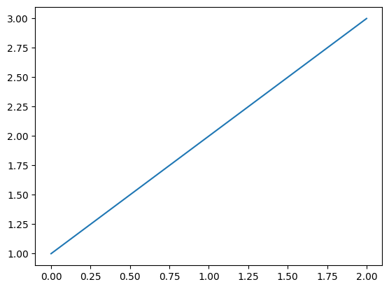

# b

<div class="code-cell" style="position:relative;"><button class="copy-btn" style="position:absolute; top:8px; right:8px;" onclick="navigator.clipboard.writeText(document.getElementById('code-cell-4376690512').innerText); this.blur();">Copy</button><pre id="code-cell-4376690512"><code class="language-python">import numpy as np</code></pre></div>

---

# example of printing an array

---

<div class="code-cell" style="position:relative;"><button class="copy-btn" style="position:absolute; top:8px; right:8px;" onclick="navigator.clipboard.writeText(document.getElementById('code-cell-4376394608').innerText); this.blur();">Copy</button><pre id="code-cell-4376394608"><code class="language-python">a = np.array([
    [1, 2, 3],
])
print(a)</code></pre></div>

**Output:**

```
[[1 2 3]]

```

---

<div class="code-cell" style="position:relative;"><button class="copy-btn" style="position:absolute; top:8px; right:8px;" onclick="navigator.clipboard.writeText(document.getElementById('code-cell-4376507824').innerText); this.blur();">Copy</button><pre id="code-cell-4376507824"><code class="language-python">import matplotlib.pyplot as plt
plt.plot(np.arange(3), a.flatten())</code></pre></div>

**Output:**

```
[<matplotlib.lines.Line2D at 0x121440550>]
```

```
<Figure size 640x480 with 1 Axes>
```



