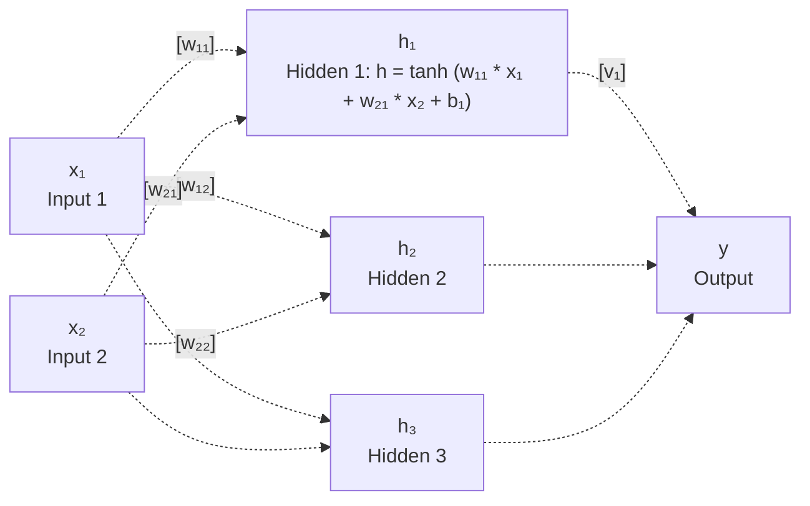

<!-- markdownlint-disable MD025 MD013 -->

# Maximum Likelihood Estimation for Neural Networks

## Introduction

In this article, I'll talk about the issues that Maximum Likelihood Estimation faces with Neural Networks. Maximum Likelihood Estimation is a concept that allows us to estimate parameters of a statistical model. Most models can be thought of as random variables which are functions of some parameters (weights and biases). These weights and biases, combined with some random draws from fundamental distributions (e.g., Gaussian, Bernoulli), can be said to generate data. The combination of weights and draws from random distributions is called a model which is supposed to describe the relationship between inputs \(x_i\) and outputs \(y_i\). The goal of MLE is to find the parameters that maximize the likelihood of observing the given data \(x_i\) and \(y_i\), where \(i\) comes from an indexing set.

MLE not only provides estimates of the parameters (an estimate is a function of data observations \(x_i\) and \(y_i\), which is said to be equal in expectation to some function of "actual" population parameters), but also gives us some nice properties of the model. MLE doesn't offer any generalizability guarantees, neither does a well fit NN. I aim to show that even a generalizable NN doesn't have consistent parameters.

1. Consistency: As the sample size approaches infinity, the MLE converges in probability to the true parameter value. This means that with sufficiently large samples, the estimator will be arbitrarily close to the actual parameter.
2. Asymptotic Normality
3. Asymptotic Efficiency

For these desirable properties to hold, several regularity conditions must be satisfied:

- Identifiability: Different parameter values must produce different probability distributions. The mapping from parameters to distributions must be one-to-one.

- Differentiability, Regularity of Support, Smoothness Conditions, Finite Fisher Information, Compact Parameter Space.

We'll focus on Identifiability and show that identifiability is not satisfied for even generalizable neural network architectures. We'll try to ascertain, using an example, whether the MLE is consistent.

## A Simple Neural Network Example

## Constructed Toy Data Analysis

I have this task at

I construct a simple neural network with one hidden layer and one output layer. The hidden layer has three neurons, and the output layer has one neuron. The hidden layer uses the hyperbolic tangent activation function, and the output layer is linear with a sigmoid activation to model the output as a probability.

